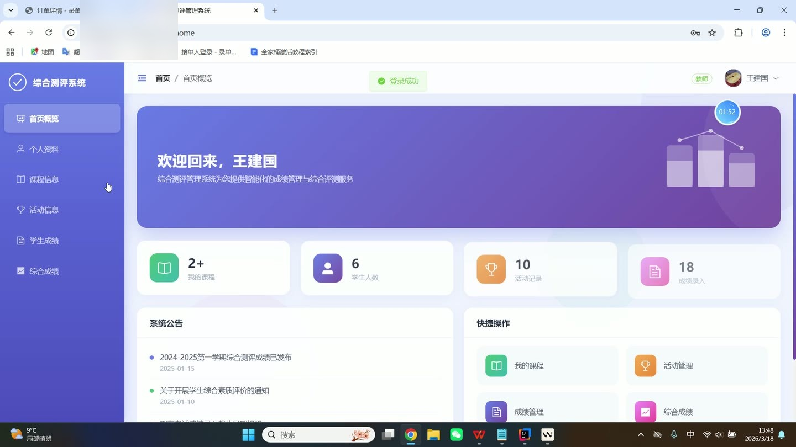
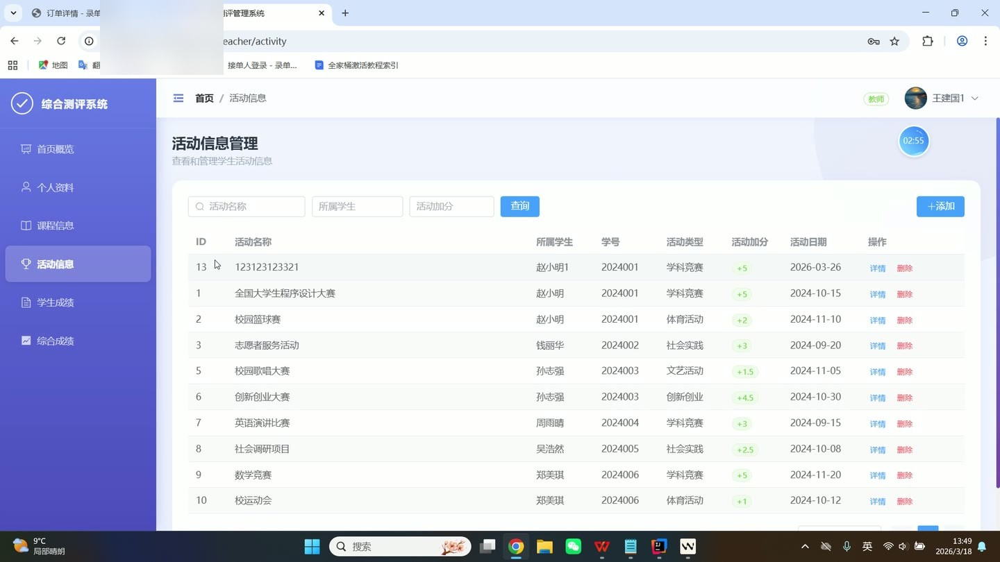
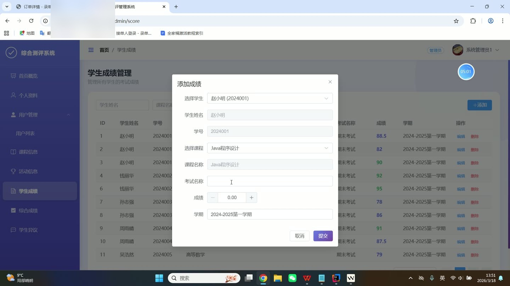
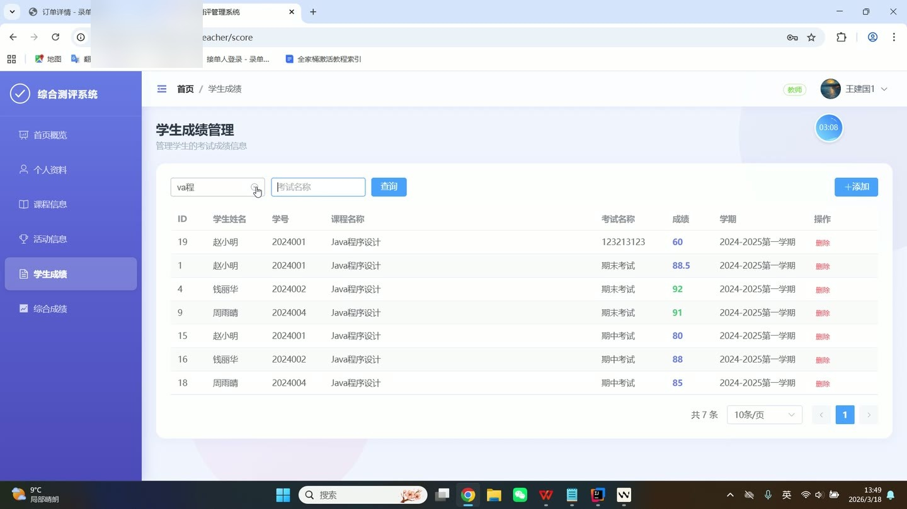
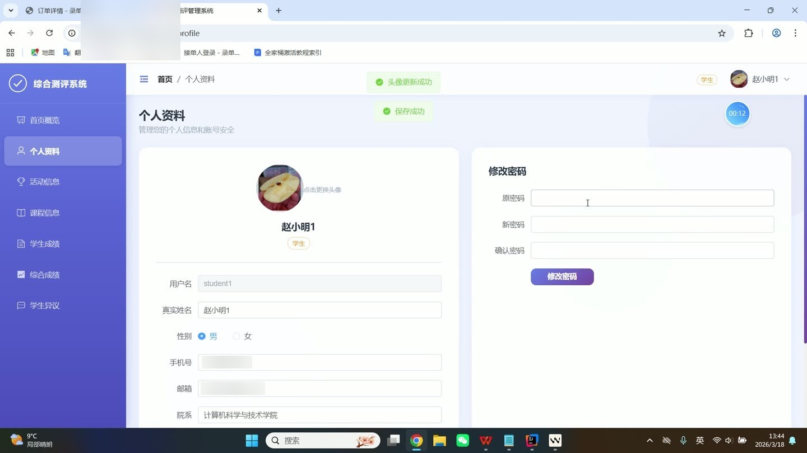

# (附文档)Springboot3+Vue3+MySQL 大学生综合素质测评管理系统

**技术栈**：Springboot3、Vue3、MySQL

### 系统简介

大学生综合素质测评管理系统基于 Spring Boot 3 + Vue 3 前后端分离架构，支持管理员、教师、学生三个角色。系统提供用户管理、课程管理、活动加分、考试成绩、综合成绩计算、学生异议处理等核心业务模块，实现学生综合素质的多维度量化评估。
 
### 核心功能
 
### 管理员端

 
- 用户管理：查看用户列表（支持按角色/真实姓名筛选）、新增/编辑/删除用户、修改用户密码 
- 课程管理：查看课程列表（支持按课程名称/教师筛选）、新增/编辑/删除课程、批量选课导入、查看课程已选学生 
- 活动管理：查看活动列表（支持按活动名称/学生姓名/加分值筛选）、新增/编辑/删除活动、上传活动封面图片 
- 学生成绩管理：查看成绩列表（支持按课程名称/考试名称/学生姓名筛选）、新增/编辑/删除成绩记录 
- 综合成绩管理：查看综合成绩列表（支持按学生姓名/学号/学期/考试成绩/活动成绩筛选）、新增/编辑/删除综合成绩 
- 学生异议管理：查看异议列表（支持按学生姓名/学号筛选）、查看异议详情、回复和处理学生异议 
- 系统首页概览：查看用户总数、课程数量、活动记录、异议待处理等统计卡片 
- 个人资料管理：修改头像、真实姓名、性别、手机号、邮箱、院系信息
 
### 教师端

 
- 课程管理：查看课程列表（支持按课程名称筛选）、新增/编辑/删除课程、查看课程已选学生 
- 活动管理：查看活动列表（支持按活动名称/学生姓名/加分值筛选）、新增/编辑/删除活动、上传活动封面图片 
- 学生成绩管理：查看成绩列表（支持按课程名称/考试名称/学生姓名筛选）、新增/编辑/删除成绩记录 
- 综合成绩管理：查看综合成绩列表（支持按学生姓名/学号/学期/考试成绩/活动成绩筛选）、新增/编辑/删除综合成绩 
- 系统首页概览：查看我的课程数、学生人数、活动记录、成绩录入等统计卡片 
- 个人资料管理：修改头像、真实姓名、性别、手机号、邮箱、院系信息
 
### 学生端

 
- 活动信息查看：查看活动列表（支持按活动名称/学生姓名筛选）、查看活动详情（含封面图、描述、加分值） 
- 课程信息查看：查看已选课程列表（支持分页）、查看课程详情（含课程名称、学分、学时、教师） 
- 学生成绩查看：查看个人成绩列表（支持按课程名称/考试名称筛选）、查看成绩详情 
- 综合成绩查看：查看个人综合成绩列表（支持按学期筛选）、查看综合成绩详情（含考试成绩、活动成绩、总分） 
- 异议提交：查看异议列表、新增异议（填写异议类型、内容）、查看管理员回复 
- 系统首页概览：查看我的课程数、我的活动数、考试成绩、综合排名等统计卡片 
- 个人资料管理：修改头像、真实姓名、性别、手机号、邮箱、院系、班级信息
 
### 技术栈

  后端框架 Spring Boot 3   ORM MyBatis-Plus   权限 前端路由守卫 + 角色菜单控制   前端框架 Vue 3   状态管理 Pinia   构建工具 Vite   UI 组件库 Element Plus   数据库 MySQL   文件上传 本地文件存储   密码加密 MD5 (Hutool)   路由 Vue Router (History 模式) 
 
### 交付内容

 
- 后端完整源码 
- 前端完整源码 
- 数据库初始化脚本 
- 万字文档

## 界面展示

---

## 获取完整源码 + 万字文档

本仓库为项目介绍页。**完整前后端源码、数据库初始化脚本、万字项目文档**，请加微信 `kangkangcode`，或访问 [codekk.top](http://codekk.top) 获取。

可作课程设计 / 毕业设计参考，支持远程部署调试。